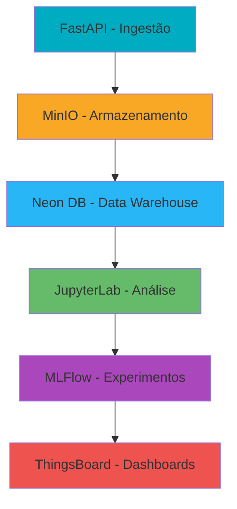

# 🌦️ Pipeline de Dados Meteorológicos - INMET

> _Sistema completo de coleta, processamento, análise e visualização de dados meteorológicos com foco em previsão de temperatura horária_

## 📋 Descrição Geral

Este projeto foi desenvolvido como parte da disciplina **Análise e Visualização de Dados (2025.2)** da **CESAR School**, implementando um pipeline de Business Intelligence para dados meteorológicos do INMET (Instituto Nacional de Meteorologia) com ênfase especial na **previsão de temperatura horária**.

O sistema coleta dados de estações meteorológicas de Pernambuco, processa e armazena as informações, aplica modelos de Machine Learning para estimar a temperatura horária e disponibiliza dashboards interativos para análise e visualização dos dados.

## 🎯 Objetivo Principal

Prever a temperatura horária com base em dados meteorológicos coletados das estações automáticas do INMET. O projeto utiliza variáveis como temperatura, umidade relativa e velocidade do vento para construir modelos preditivos que capturam padrões sazonais e diários, auxiliando na tomada de decisão em setores como agricultura e planejamento urbano.

Neste projeto, o objetivo central é estimar a temperatura horária a partir de dados reais coletados das estações automáticas do INMET. A escolha dessa problemática se justifica pela forte relação entre a temperatura e outras variáveis meteorológicas, com destaque para a umidade relativa do ar, velocidade do vento e a própria temperatura registrada previamente. Essas variáveis influenciam diretamente a dinâmica térmica da atmosfera e permitem a construção de modelos preditivos capazes de capturar padrões sazonais, variações diárias e comportamentos característicos do clima de Pernambuco.

Com base no conjunto de dados disponibilizado, foi estruturado um processo analítico que inclui preparação dos dados, interpretação dos padrões identificados e construção de um modelo preditivo. O foco do estudo está na capacidade de identificar como cada variável contribui para o comportamento da temperatura ao longo do tempo e de que forma essas relações podem ser utilizadas para gerar previsões confiáveis.

### Variáveis Utilizadas

- 🌡️ **Temperatura** (°C)
- 💧 **Umidade** (%)
- 💨 **Velocidade do Vento** (m/s)

### Visualizações Principais

- 📈 Curva real vs. prevista da temperatura horária
- 🌳 Importância das variáveis na árvore de decisão
- 🔍 Análise de resíduos e performance do modelo

## 🏗️ Arquitetura do Pipeline



## 📁 Estrutura do Repositório

```
pipeline-meteorologico/
├── 📦 docker-compose.yml
├── 🔬 jupyterlab/
│   └── Dockerfile
├── 📊 mlflow/
│   └── Dockerfile
├── 🌐 fastapi/
│   ├── app/
│   ├── requirements.txt
│   └── Dockerfile
├── 📓 notebooks/
│   ├── exploracao_dados.ipynb
│   ├── modelagem_temperatura_horaria.ipynb      # FOCO NO TEMA
│   ├── importancia_variaveis.ipynb           # FOCO NO TEMA
│   └── analise_temporal.ipynb
├── 🗃️ sql_scripts/
│   ├── create_tables.sql
│   ├── calculo_temperatura_horaria.sql          # FOCO NO TEMA
│   └── queries_analiticas.sql
├── 📈 trendz/
│   └── Dockerfile
├── 📋 reports/
│   └── documentacao_temperatura_horaria.md      # FOCO NO TEMA
├── 📄 README.md
├── 🖼️ img/
│   └── image.png
└── ⚖️ LICENSE
```

## 🚀 Como Executar o Projeto

Este guia foi feito para que **qualquer pessoa**, mesmo sem conhecimento técnico, consiga rodar o projeto. Siga os passos com calma!

---

### 📋 Pré-requisitos (O que você precisa ter instalado)

Antes de começar, você precisa instalar alguns programas no seu computador:

#### 1. **Docker Desktop** (Obrigatório)

O Docker é como uma "caixa mágica" que roda todos os serviços do projeto de forma isolada.

- 📥 **Baixe aqui**: [https://www.docker.com/products/docker-desktop](https://www.docker.com/products/docker-desktop)
- Clique em "Download for Windows" (ou Mac, se for o caso)
- Execute o instalador e siga as instruções na tela
- **Após instalar, reinicie o computador**
- Abra o Docker Desktop e aguarde ele iniciar (ícone fica verde)

#### 2. **Git** (Para baixar o projeto)

- 📥 **Baixe aqui**: [https://git-scm.com/downloads](https://git-scm.com/downloads)
- Execute o instalador, pode clicar em "Next" em todas as telas

#### 3. **Python 3.10+** (Opcional, para rodar scripts localmente)

- 📥 **Baixe aqui**: [https://www.python.org/downloads/](https://www.python.org/downloads/)
- **IMPORTANTE**: Marque a opção ✅ "Add Python to PATH" durante a instalação

---

### 🔧 Passo a Passo para Rodar o Projeto

#### **Passo 1: Baixar o Projeto**

1. Abra o **Prompt de Comando** (Windows) ou **Terminal** (Mac/Linux)
   - No Windows: Pressione `Win + R`, digite `cmd` e pressione Enter
2. Escolha uma pasta para salvar o projeto (exemplo: Documentos):

```bash
cd Documents
```

3. Baixe o projeto:

```bash
git clone https://github.com/Taverna-Hub/Projeto-AVD.git
```

4. Entre na pasta do projeto:

```bash
cd Projeto-AVD
```

---

#### **Passo 2: Configurar as Variáveis de Ambiente**

O projeto precisa de algumas "senhas" e configurações para funcionar.

> ⚠️ **IMPORTANTE**: O arquivo `.env` contém credenciais sensíveis (AWS, banco de dados, etc.) e **não está incluído no repositório** por questões de segurança.
>
> 📧 **Apenas o professor da disciplina terá acesso ao arquivo `.env` completo do projeto.** Solicite as credenciais diretamente com ele.

1. Após receber o arquivo `.env` do professor, coloque-o na pasta raiz do projeto (mesma pasta do `docker-compose.yml`)

2. Verifique se o arquivo está no lugar certo:

```bash
dir .env
```

Se aparecer o arquivo, está tudo certo!

---

#### **Passo 3: Iniciar os Serviços (A Parte Mágica! ✨)**

1. **Certifique-se que o Docker Desktop está aberto e rodando** (ícone verde na barra de tarefas)

2. No terminal, dentro da pasta do projeto, enquanto o docker estiver rodando,execute:

```bash
docker-compose up -d
```

3. **Aguarde!** ⏳ Na primeira vez, pode demorar de 5 a 15 minutos para baixar tudo.

4. Para verificar se está tudo rodando:

```bash
docker-compose ps
```

Você deve ver vários serviços com status "Up" ou "running".

---

#### **Passo 4: Acessar os Serviços**

Após iniciar, abra seu navegador e acesse:

| 🌐 Serviço      | 🔗 Link                                                  | 📝 O que é?                                     |
| --------------- | -------------------------------------------------------- | ----------------------------------------------- |
| **ThingsBoard** | [http://localhost:9090](http://localhost:9090)           | Dashboard IoT - Visualize os dados das estações |
| **JupyterLab**  | [http://localhost:8888](http://localhost:8888)           | Notebooks Python - Análise de dados             |
| **FastAPI**     | [http://localhost:8060/docs](http://localhost:8060/docs) | API - Documentação interativa                   |
| **MLflow**      | [http://localhost:5000](http://localhost:5000)           | Experimentos de Machine Learning                |

##### 🔐 Login no ThingsBoard:

- **Usuário**: `tenant@thingsboard.org`
- **Senha**: `tenant`

---

### 📊 Carregar os Dados nas Plataformas

Após os serviços estarem rodando, você precisa carregar os dados. Execute os comandos abaixo **em ordem**:

#### **1. Criar os devices de dados brutos no ThingsBoard**
Acesse o link do INMET e baixe os dados meteorológicos das cidades (menos Recife) de 2020 até 2024: https://portal.inmet.gov.br/dadoshistoricos
Adicione na pasta /data do projeto os arquivos extraídos.

Acesse o container do FastAPI para executar os scripts:

```bash
docker exec -it fastapi-app bash
```

Dentro do container, navegue até a pasta de scripts:

```bash
cd src/scripts
```

Agora você pode executar os scripts diretamente:

```bash
python3 setup_devices.py
```

Isso criará os 12 devices (um para cada estação meteorológica) no ThingsBoard.

---

#### **2. Enviar os dados para o bucket S3**

Ainda dentro do container (pasta `src/scripts`):

```bash
python3 test_s3_upload.py
```

Isso enviará os arquivos CSV de todas as 12 estações (2020-2024) para o bucket S3 na Amazon.

---

### 🔄 Pipeline do Neon (Processamento Automático)

Agora vamos iniciar o processamento automático dos dados no banco Neon:

#### **3. Iniciar o container do Neon Pipeline**

```bash
docker-compose up neon_pipeline
```

Este comando inicia um container que automaticamente:

- Conecta ao bucket S3
- Lê os arquivos CSV das estações
- Processa e insere os dados no banco de dados Neon

> 💡 **Dica**: Aguarde até ver mensagens de sucesso no terminal antes de prosseguir.

---

### 📓 Execução dos Notebooks (Tratamento e Imputação)

Agora vamos executar os notebooks para tratar os dados e treinar os modelos de Machine Learning:

#### **4. Acessar o JupyterLab**

1. Abra seu navegador
2. Acesse: [http://localhost:8888](http://localhost:8888)
3. Você verá a interface do JupyterLab

---

#### **5. Executar o Notebook de Tratamento de Dados**

1. No JupyterLab, navegue até a pasta `work/`
2. Abra o arquivo `01_tratamento_dados.ipynb`
3. Execute todas as células do notebook:
   - Clique em **Run** → **Run All Cells**
   - Ou use o atalho: `Ctrl + Shift + Enter`
4. **Aguarde** todas as células terminarem de executar (pode demorar alguns minutos)

> 📝 Este notebook faz a limpeza e preparação dos dados meteorológicos.

---

#### **6. Executar o Notebook de Imputação de Dados**

1. Após o notebook 01 terminar, abra o arquivo `02_imputacao_dados.ipynb`
2. Execute todas as células do notebook:
   - Clique em **Run** → **Run All Cells**
3. **Aguarde** a execução completa

> 📝 Este notebook treina modelos de Machine Learning para preencher dados faltantes e envia os logs/modelos para o MLflow.

> 💡 **Dica**: Você pode acompanhar os experimentos em tempo real acessando o MLflow em [http://localhost:5000](http://localhost:5000)

---

### 📈 Devices Processados (Dados Tratados)

Agora vamos criar os devices com os dados já processados/tratados:

#### **7. Criar os devices processados no ThingsBoard**

Acesse o container do FastAPI (se ainda não estiver):

```bash
docker compose exec -it fastapi-app bash
cd src/scripts
```

Execute o script:

```bash
python3 create_processed_devices.py
```

Isso criará novos devices no ThingsBoard para armazenar os dados após o tratamento e imputação.

---

#### **8. Popular os devices com dados processados**

Ainda dentro do container (pasta `src/scripts`):

```bash
python3 send_telemetry_to_devices.py
```

Este script:

- Lê os dados processados do S3
- Envia as telemetrias para os devices processados no ThingsBoard
- Permite visualizar os dados tratados nos dashboards

---

### 📊 Importar e Visualizar Dashboards

Agora vamos importar os dashboards pré-configurados e visualizar os dados no ThingsBoard:

#### **9. Importar os dashboards no ThingsBoard**

Ainda dentro do container (pasta `src/scripts`):

```bash
python3 import_dashboards.py
```

Este script importa automaticamente todos os dashboards disponíveis na pasta `reports/` para o ThingsBoard.

---

#### **10. Acessar os dashboards**

1. Abra seu navegador
2. Acesse: [http://localhost:9090](http://localhost:9090)
3. Faça login com as credenciais:
   - **Usuário**: `tenant@thingsboard.org`
   - **Senha**: `tenant`
4. No menu lateral, clique em **Dashboards**
5. Selecione o dashboard desejado para visualizar os dados

---

#### **⚠️ Solução de Problemas nos Dashboards**

Se os dados **não aparecerem** nos widgets do dashboard, provavelmente é um **erro de conflito nos IDs dos devices**. Para corrigir:

1. **Abra o dashboard** que está sem dados
2. Clique no botão **Editar** (ícone de lápis no canto inferior direito)
3. **Clique no widget** que está sem dados
4. No painel de configuração que abrir, clique em **Editar widget**
5. Na aba **Fonte de dados** (ou **Entity**), clique no device atual
6. **Selecione o device correto** que corresponde ao widget (ex: se é um widget de temperatura de PETROLINA, selecione o device "PETROLINA" ou "PETROLINA_PROCESSADO")
7. Clique em **Aplicar** e depois em **Salvar** o dashboard

> 💡 **Nota**: Os devices com sufixo `- Processado` contêm os dados tratados e imputados. Use estes nos dashboards de cima e os sem o sufixo nos dashboard de baixo.

---

### ✅ Resumo da Ordem de Execução

| Etapa | Comando                                               | O que faz                    |
| ----- | ----------------------------------------------------- | ---------------------------- |
| 0     | `docker compose exec -it fastapi-app bash` + `cd src/scripts` | Acessar container do FastAPI |
| 1     | `python3 setup_devices.py`                            | Cria devices de dados brutos |
| 2     | `python3 test_s3_upload.py`                           | Envia CSVs para o S3         |
| 3     | `docker-compose up neon_pipeline`                     | Processa dados no Neon       |
| 4     | Acessar `localhost:8888`                              | Abrir JupyterLab             |
| 5     | Executar `01_tratamento_dados.ipynb`                  | Tratar dados                 |
| 6     | Executar `02_imputacao_dados.ipynb`                   | Imputar dados + MLflow       |
| 7     | `python3 create_processed_devices.py`                 | Cria devices processados     |
| 8     | `python3 send_telemetry_to_devices.py`                | Popula devices processados   |
| 9     | `python3 import_dashboards.py`                        | Importa dashboards           |
| 10    | Acessar `localhost:9090`                              | Visualizar dashboards        |

---

### 🛑 Como Parar o Projeto

Quando terminar de usar, você pode parar todos os serviços:

```bash
docker-compose down
```

Para parar E apagar todos os dados (começar do zero):

```bash
docker-compose down -v
```

---

### 🔄 Comandos Úteis do Dia a Dia

| Comando                           | O que faz                         |
| --------------------------------- | --------------------------------- |
| `docker-compose up -d`            | Inicia todos os serviços          |
| `docker-compose down`             | Para todos os serviços            |
| `docker-compose ps`               | Mostra o status dos serviços      |
| `docker-compose logs -f`          | Mostra os logs em tempo real      |
| `docker-compose restart`          | Reinicia todos os serviços        |
| `docker-compose logs thingsboard` | Ver logs de um serviço específico |

---

### ❓ Problemas Comuns e Soluções

#### ❌ "Docker não está rodando"

- Abra o Docker Desktop e aguarde ele iniciar completamente (ícone fica verde)

#### ❌ "Porta já está em uso"

- Algum outro programa está usando a porta. Feche outros programas ou reinicie o computador.

#### ❌ "Erro de conexão com ThingsBoard"

- Aguarde mais alguns minutos. O ThingsBoard demora para iniciar completamente.
- Verifique se o container está saudável: `docker-compose ps`

#### ❌ "Python não encontrado"

- Reinstale o Python marcando a opção "Add to PATH"
- Ou use: `python3` ao invés de `python`

#### ❌ "Módulo não encontrado" ao rodar scripts Python

- Instale as dependências:

```bash
pip install -r fastapi/requirements.txt
pip install python-dotenv boto3 psycopg2-binary pandas
```

---

### 📱 Resumo Rápido (Para quem tem pressa)

```bash
# 1. Clone o projeto
git clone https://github.com/Taverna-Hub/Projeto-AVD.git
cd Projeto-AVD

# 2. Inicie os serviços
docker-compose up -d

# 3. Aguarde 5-10 minutos e acesse:
# ThingsBoard: http://localhost:9090 (login: tenant@thingsboard.org / tenant)
# JupyterLab: http://localhost:8888
# API Docs: http://localhost:8060/docs

# 4. Para parar
docker-compose down
```

---

## 🔄 Fluxo de Funcionamento para Previsão de Temperatura Horária

### 1. Coleta de Dados para Modelo

```python
# Exemplo de requisição para ingestão com variáveis de temperatura horária
import requests

payload = {
    "estacao": "A001",
    "data": "2025-01-15",
    "temperatura": 28.5,      # Variável preditora
    "umidade": 75,            # Variável preditora
    "velocidade_vento": 3.2,  # Variável preditora
    "temperatura_horaria": 30.1  # Variável alvo (para treinamento)
}

response = requests.post("http://localhost:8000/dados", json=payload)
```

### 2. Processamento Específico para Temperatura Horária

- Cálculo da temperatura horária usando dados das estações do INMET
- Feature engineering: interações entre temperatura, umidade e vento
- Normalização das variáveis climáticas
- Split temporal para validação

### 3. Modelagem Preditiva da Temperatura Horária

- **Algoritmos**: Random Forest, XGBoost, Regressão Linear
- **Variáveis**: Temperatura, Umidade, Velocidade do Vento
- **Métricas**: MAE, RMSE, R², MAPE
- **Validação**: Time Series Split

## 🤖 Modelagem de Temperatura Horária

### Abordagens de Machine Learning

| Técnica                     | Objetivo                        | Métricas              | Variáveis            |
| --------------------------- | ------------------------------- | --------------------- | -------------------- |
| **Regressão Random Forest** | Previsão de temperatura horária | MAE, RMSE, R²         | Temp, Umidade, Vento |
| **Análise de Importância**  | Rankear variáveis influentes    | Feature Importance    | Todas as features    |
| **Visualização**            | Real vs. Previsto               | Gráficos comparativos | Temperatura horária  |

### Exemplo de Código para Modelagem

```python
# Modelo de temperatura horária
from sklearn.ensemble import RandomForestRegressor

modelo_temperatura = RandomForestRegressor(
    n_estimators=100,
    max_depth=10,
    random_state=42
)

# Variáveis para o modelo
X = dados[['temperatura', 'umidade', 'velocidade_vento']]
y = dados['temperatura_horaria']

modelo_temperatura.fit(X, y)
```

## 📊 Dashboards e Visualizações - Temperatura Horária

### Trendz Analytics - Foco no Tema

- **Dashboard Temperatura Horária**: Comparação real vs. prevista
- **Importância das Variáveis**: Gráfico de importância da árvore
- **Análise de Resíduos**: Distribuição dos erros de previsão
- **Temperatura por Condições**: Heatmaps de temperatura vs. temperatura/umidade

### Visualizações Específicas

1. **Curva Real vs. Prevista**: Linhas sobrepostas mostrando acurácia do modelo
2. **Importância na Árvore**: Bar plot com contribuição de cada variável
3. **Matriz de Correlação**: Relação entre variáveis climáticas
4. **Distribuição de Erros**: Histograma dos resíduos da previsão

### Acesso aos Dashboards

1. Acesse http://localhost:8080
2. Navegue para o dashboard "Temperatura Horária"
3. Explore as visualizações interativas

## 👥 Autores do Projeto

<div align="center">
<table>
  <tr>
    <td align="center">
      
      <br />
      <sub><b>Ana Clara</b></sub>
      <br />
      <a href="https://github.com/Pandor4b">@Pandor4b</a>
    </td>
    <td align="center">
      
      <br />
      <sub><b>Paulo Rosado</b></sub>
      <br />
      <a href="https://github.com/paulorosadodev">@paulorosadodev</a>
    </td>
    <td align="center">
      
      <br />
      <sub><b>Sophia Gallindo</b></sub>
      <br />
      <a href="https://github.com/sophia-15">@sophia-15</a>
    </td>
    <td align="center">
      
      <br />
      <sub><b>Gustavo Mourato</b></sub>
      <br />
      <a href="https://github.com/gustavoyoq">@gustavoyoq</a>
    </td>
  </tr>
</table>
<table>
  <tr>
    <td align="center">
      
      <br />
      <sub><b>Gabriel Albuquerque</b></sub>
      <br />
      <a href="https://github.com/deadcube04">@deadcube04</a>
    </td>
    <td align="center">
      
      <br />
      <sub><b>Thomaz Lima</b></sub>
      <br />
      <a href="https://github.com/Thomazrlima">@Thomazrlima</a>
    </td>
    <td align="center">
      
      <br />
      <sub><b>Vinícius de Andrade</b></sub>
      <br />
      <a href="https://github.com/viniciusdandrade">@viniciusdandrade</a>
    </td>
  </tr>
</table>

</div>

## 🙏 Agradecimentos

- **Disciplina**: Análise e Visualização de Dados - 2025.2
- **Instituição**: CESAR School
- **Professor Diego de Freitas**: Pelo suporte técnico e orientação
- **INMET**: Pela disponibilização dos dados meteorológicos

---

<div align="center">

**🌡️ Previsão da temperatura, compreensão do clima**

_CESAR School • Análise e Visualização de Dados • 2025.2_

</div>