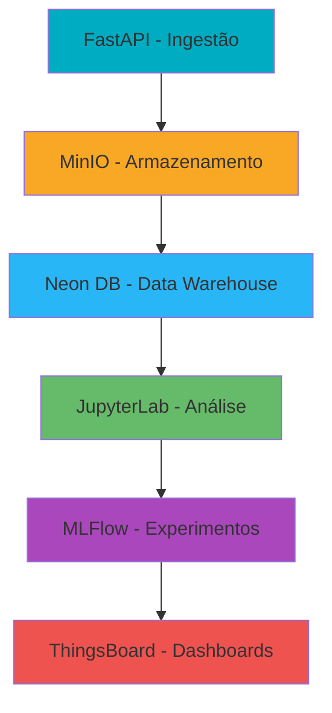

# 🌦️ Pipeline de Dados Meteorológicos - INMET

> *Sistema completo de coleta, processamento, análise e visualização de dados meteorológicos com foco em previsão de temperatura horária*

## 📋 Descrição Geral

Este projeto foi desenvolvido como parte da disciplina **Análise e Visualização de Dados (2025.2)** da **CESAR School**, implementando um pipeline de Business Intelligence para dados meteorológicos do INMET (Instituto Nacional de Meteorologia) com ênfase especial na **previsão de temperatura horária**.

O sistema coleta dados de estações meteorológicas de Pernambuco, processa e armazena as informações, aplica modelos de Machine Learning para estimar a temperatura horária e disponibiliza dashboards interativos para análise e visualização dos dados.

## 🎯 Objetivo Principal

Prever a temperatura horária com base em dados meteorológicos coletados das estações automáticas do INMET. O projeto utiliza variáveis como temperatura, umidade relativa e velocidade do vento para construir modelos preditivos que capturam padrões sazonais e diários, auxiliando na tomada de decisão em setores como agricultura e planejamento urbano.

Neste projeto, o objetivo central é estimar a temperatura horária a partir de dados reais coletados das estações automáticas do INMET. A escolha dessa problemática se justifica pela forte relação entre a temperatura e outras variáveis meteorológicas, com destaque para a umidade relativa do ar, velocidade do vento e a própria temperatura registrada previamente. Essas variáveis influenciam diretamente a dinâmica térmica da atmosfera e permitem a construção de modelos preditivos capazes de capturar padrões sazonais, variações diárias e comportamentos característicos do clima de Pernambuco.

Com base no conjunto de dados disponibilizado, foi estruturado um processo analítico que inclui preparação dos dados, interpretação dos padrões identificados e construção de um modelo preditivo. O foco do estudo está na capacidade de identificar como cada variável contribui para o comportamento da temperatura ao longo do tempo e de que forma essas relações podem ser utilizadas para gerar previsões confiáveis.

### Variáveis Utilizadas
- 🌡️ **Temperatura** (°C)
- 💧 **Umidade** (%)
- 💨 **Velocidade do Vento** (m/s)

### Visualizações Principais
- 📈 Curva real vs. prevista da temperatura horária
- 🌳 Importância das variáveis na árvore de decisão
- 🔍 Análise de resíduos e performance do modelo

## 🏗️ Arquitetura do Pipeline



### Fluxo de Dados para Previsão de Temperatura Horária
1. **Ingestão**: API REST coleta dados meteorológicos via FastAPI
2. **Armazenamento**: Dados brutos salvos no MinIO (S3-compatible)
3. **Processamento**: Cálculo de temperatura horária e estruturação no Neon DB
4. **Análise**: Feature engineering e modelagem em Jupyter Notebooks
5. **MLOps**: Registro e tracking de experimentos de temperatura horária com MLFlow
6. **Visualização**: Dashboards interativos com comparação real vs. previsto


### Camadas de Armazenamento

A solução utiliza diferentes camadas de armazenamento, separando dados brutos, dados estruturados e artefatos de machine learning:

| **Tipo**            | **Tecnologia**     | **Localização**          |
|----------------------|--------------------|--------------------------|
| **Arquivos brutos**  | AWS S3            | Nuvem                    |
| **Dados estruturados** | Neon PostgreSQL   | Nuvem (serverless)       |
| **Metadados do MLflow** | PostgreSQL       | Container local          |
| **Artefatos de ML**  | Volume Docker     | Local (`/mlflow/artifacts`) |

Os arquivos brutos oriundos das estações do INMET são armazenados em um bucket único no AWS S3. Após o processamento inicial, os dados são carregados e organizados em tabelas no Neon PostgreSQL, que assume o papel de banco relacional na nuvem com dados estruturados. O MLflow utiliza um PostgreSQL local para registrar execuções, parâmetros e métricas dos experimentos. Os artefatos de modelo (por exemplo, arquivos serializados) são armazenados em um volume Docker, garantindo persistência local entre reinicializações dos contêineres.

A opção por utilizar um único bucket S3 para dados brutos foi motivada pelo volume relativamente pequeno de dados do projeto e pela necessidade de manter o custo da infraestrutura mais baixo. Separar em múltiplos buckets, embora possível, não traria ganho significativo de organização para o escopo atual, mas aumentaria a complexidade e o custo de gerenciamento na nuvem.

### Fluxo de Dados

De forma resumida, o fluxo de dados implementado segue a mesma lógica geral descrita na especificação do projeto com adaptações pontuais:

1. **Ingestão**: A API FastAPI recebe os dados meteorológicos do INMET e os armazena no ThingsBoard que o envia para o bucket S3 através da FastAPI. Quando necessário, a própria API acessa esse bucket, recupera os dados já processados e os envia diretamente ao ThingsBoard para atualização imediata do dashboard.
2. **Estruturação**: A partir dos arquivos armazenados no S3, os dados são processados e carregados para o PostgreSQL em nuvem, onde são organizados em tabelas adequadas para consulta, análise e preparação posterior para modelagem.
3. **Análise e Modelagem**: O JupyterLab acessa o banco estruturado, realiza o tratamento dos dados, cria as variáveis derivadas e treina o modelo de previsão da temperatura horária. Durante todo esse processo, o MLflow registra parâmetros, métricas e versões do modelo, utilizando o Neon para metadados e o volume local `/mlflow/artifacts` para armazenar os artefatos do modelo.
4. **Visualização**: Sempre que o MLflow recebe uma nova execução, um monitor implementado no código detecta a atualização, acessa novamente o bucket S3 para recuperar os dados processados e envia os resultados atualizados ao ThingsBoard. Dessa forma, o dashboard permanece continuamente sincronizado com os dados mais recentes e com as predições geradas pelo modelo.

## 🛠️ Tecnologias Utilizadas

| Categoria          | Tecnologias                                   |
|--------------------|-----------------------------------------------|
| **Backend**        | FastAPI, Python 3.9+, Uvicorn                |
| **Armazenamento**  | AWS S3, Neon PostgreSQL, Docker Volumes      |
| **Análise**        | JupyterLab, Pandas, Scikit-learn, NumPy      |
| **MLOps**          | MLFlow, PostgreSQL (local)                   |
| **Visualização**   | ThingsBoard, Matplotlib, Seaborn             |
| **Orquestração**   | Docker, Docker Compose                       |
| **Linguagens**     | Python, SQL                                  |

### Acesso aos Serviços

| **Container**   | **Porta** | **Função**                                      |
|------------------|-----------|------------------------------------------------|
| **FastAPI**      | 8060      | API REST para ingestão e processamento de dados |
| **ThingsBoard**  | 9090      | Plataforma IoT utilizada para visualização e construção de dashboards |
| **PostgreSQL**   | 5432      | Banco de dados relacional usado pelo MLflow para metadados |
| **JupyterLab**   | 8888      | Ambiente interativo para análise exploratória e notebooks |
| **MLflow**       | 5000      | Serviço de tracking de experimentos e versionamento de modelos |

## 📁 Estrutura do Repositório

```
pipeline-meteorologico/
├── 📦 docker-compose.yml
├── 🔬 jupyterlab/
│   └── Dockerfile
├── 📊 mlflow/
│   └── Dockerfile
├── 🌐 fastapi/
│   ├── app/
│   ├── requirements.txt
│   └── Dockerfile
├── 📓 notebooks/
│   ├── exploracao_dados.ipynb
│   ├── modelagem_temperatura_horaria.ipynb      # FOCO NO TEMA
│   ├── importancia_variaveis.ipynb           # FOCO NO TEMA
│   └── analise_temporal.ipynb
├── 🗃️ sql_scripts/
│   ├── create_tables.sql
│   ├── calculo_temperatura_horaria.sql          # FOCO NO TEMA
│   └── queries_analiticas.sql
├── 📈 trendz/
│   └── Dockerfile
├── 📋 reports/
│   └── documentacao_temperatura_horaria.md      # FOCO NO TEMA
├── 📄 README.md
├── 🖼️ img/
│   └── image.png
└── ⚖️ LICENSE
```

## 🚀 Como Executar o Projeto

### Pré-requisitos
- Docker 20.10+
- Docker Compose 2.0+
- 4GB de RAM disponível
- Portas 8000, 8888, 5000, 9000 liberadas

### Execução Completa

```bash
# Clone o repositório
git clone https://github.com/seu-usuario/pipeline-meteorologico.git
cd pipeline-meteorologico

# Inicie todos os serviços
docker-compose up -d

# Verifique o status dos containers
docker-compose ps
```

### Acesso aos Serviços

| Serviço | URL | Porta | Descrição |
|---------|-----|-------|-----------|
| **FastAPI** | http://localhost:8060/docs | 8060 | API de ingestão de dados |
| **JupyterLab** | http://localhost:8888 | 8888 | Ambiente de análise (senha: avd2025) |
| **MLFlow** | http://localhost:5000 | 5000 | Tracking de experimentos |
| **MinIO** | http://localhost:9000 | 9000 | Armazenamento de objetos |
| **Trendz** | http://localhost:8080 | 8080 | Dashboards interativos |

### Comandos Úteis

```bash
# Parar todos os serviços
docker-compose down

# Ver logs em tempo real
docker-compose logs -f

# Reiniciar um serviço específico
docker-compose restart fastapi

# Acessar container específico
docker-compose exec jupyterlab bash
```

## 🔄 Fluxo de Funcionamento para Previsão de Temperatura Horária

### 1. Coleta de Dados para Modelo
```python
# Exemplo de requisição para ingestão com variáveis de temperatura horária
import requests

payload = {
    "estacao": "A001",
    "data": "2025-01-15",
    "temperatura": 28.5,      # Variável preditora
    "umidade": 75,            # Variável preditora  
    "velocidade_vento": 3.2,  # Variável preditora
    "temperatura_horaria": 30.1  # Variável alvo (para treinamento)
}

response = requests.post("http://localhost:8000/dados", json=payload)
```

### 2. Processamento Específico para Temperatura Horária
- Cálculo da temperatura horária usando dados das estações do INMET
- Feature engineering: interações entre temperatura, umidade e vento
- Normalização das variáveis climáticas
- Split temporal para validação

### 3. Modelagem Preditiva da Temperatura Horária
- **Algoritmos**: Random Forest, XGBoost, Regressão Linear
- **Variáveis**: Temperatura, Umidade, Velocidade do Vento
- **Métricas**: MAE, RMSE, R², MAPE
- **Validação**: Time Series Split

## 🤖 Modelagem de Temperatura Horária

### Abordagens de Machine Learning

| Técnica | Objetivo | Métricas | Variáveis |
|---------|----------|----------|-----------|
| **Regressão Random Forest** | Previsão de temperatura horária | MAE, RMSE, R² | Temp, Umidade, Vento |
| **Análise de Importância** | Rankear variáveis influentes | Feature Importance | Todas as features |
| **Visualização** | Real vs. Previsto | Gráficos comparativos | Temperatura horária |

### Exemplo de Código para Modelagem
```python
# Modelo de temperatura horária
from sklearn.ensemble import RandomForestRegressor

modelo_temperatura = RandomForestRegressor(
    n_estimators=100,
    max_depth=10,
    random_state=42
)

# Variáveis para o modelo
X = dados[['temperatura', 'umidade', 'velocidade_vento']]
y = dados['temperatura_horaria']

modelo_temperatura.fit(X, y)
```

## 📊 Dashboards e Visualizações - Temperatura Horária

### Trendz Analytics - Foco no Tema
- **Dashboard Temperatura Horária**: Comparação real vs. prevista
- **Importância das Variáveis**: Gráfico de importância da árvore
- **Análise de Resíduos**: Distribuição dos erros de previsão
- **Temperatura por Condições**: Heatmaps de temperatura vs. temperatura/umidade

### Visualizações Específicas
1. **Curva Real vs. Prevista**: Linhas sobrepostas mostrando acurácia do modelo
2. **Importância na Árvore**: Bar plot com contribuição de cada variável
3. **Matriz de Correlação**: Relação entre variáveis climáticas
4. **Distribuição de Erros**: Histograma dos resíduos da previsão

### Acesso aos Dashboards
1. Acesse http://localhost:8080
2. Navegue para o dashboard "Temperatura Horária"
3. Explore as visualizações interativas

## 👥 Autores do Projeto
<div align="center">
<table>
  <tr>
    <td align="center">
      
      <br />
      <sub><b>Ana Clara</b></sub>
      <br />
      <a href="https://github.com/Pandor4b">@Pandor4b</a>
    </td>
    <td align="center">
      
      <br />
      <sub><b>Paulo Rosado</b></sub>
      <br />
      <a href="https://github.com/paulorosadodev">@paulorosadodev</a>
    </td>
    <td align="center">
      
      <br />
      <sub><b>Sophia Gallindo</b></sub>
      <br />
      <a href="https://github.com/sophia-15">@sophia-15</a>
    </td>
    <td align="center">
      
      <br />
      <sub><b>Gustavo Mourato</b></sub>
      <br />
      <a href="https://github.com/gustavoyoq">@gustavoyoq</a>
    </td>
  </tr>
</table>
<table>
  <tr>
    <td align="center">
      
      <br />
      <sub><b>Gabriel Albuquerque</b></sub>
      <br />
      <a href="https://github.com/deadcube04">@deadcube04</a>
    </td>
    <td align="center">
      
      <br />
      <sub><b>Thomaz Lima</b></sub>
      <br />
      <a href="https://github.com/Thomazrlima">@Thomazrlima</a>
    </td>
    <td align="center">
      
      <br />
      <sub><b>Vinícius de Andrade</b></sub>
      <br />
      <a href="https://github.com/viniciusdandrade">@viniciusdandrade</a>
    </td>
  </tr>
</table>

</div>

## 🙏 Agradecimentos

- **Disciplina**: Análise e Visualização de Dados - 2025.2
- **Instituição**: CESAR School
- **Professor Diego de Freitas**: Pelo suporte técnico e orientação
- **INMET**: Pela disponibilização dos dados meteorológicos

---

<div align="center">

**🌡️ Previsão da temperatura, compreensão do clima**

*CESAR School • Análise e Visualização de Dados • 2025.2*

</div>
