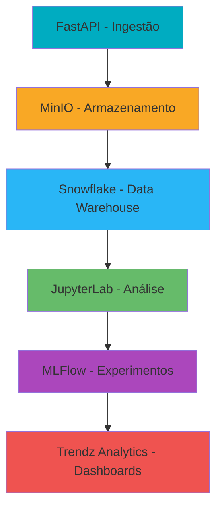

# 🌦️ Pipeline de Dados Meteorológicos - INMET

> *Sistema completo de coleta, processamento, análise e visualização de dados meteorológicos em tempo real*

## 📋 Descrição Geral

Este projeto foi desenvolvido como parte da disciplina **Análise e Visualização de Dados (2025.2)** da **CESAR School**, implementando um pipeline de Business Intelligence para dados meteorológicos do INMET (Instituto Nacional de Meteorologia).

O sistema coleta dados de estações meteorológicas de Pernambuco, processa e armazena as informações, aplica modelos de Machine Learning e disponibiliza dashboards interativos para análise e visualização dos dados.

## 🏗️ Arquitetura do Pipeline



### Fluxo de Dados
1. **Ingestão**: API REST coleta dados meteorológicos via FastAPI
2. **Armazenamento**: Dados brutos salvos no MinIO (S3-compatible)
3. **Processamento**: Estruturação e transformação no Snowflake
4. **Análise**: Exploração e modelagem em Jupyter Notebooks
5. **MLOps**: Registro e tracking de experimentos com MLFlow
6. **Visualização**: Dashboards interativos no Trendz Analytics

## 🛠️ Tecnologias Utilizadas

| Categoria | Tecnologias |
|-----------|-------------|
| **Backend** | FastAPI, Python 3.9+, Uvicorn |
| **Armazenamento** | MinIO, Snowflake |
| **Análise** | JupyterLab, Pandas, Scikit-learn |
| **MLOps** | MLFlow |
| **Visualização** | Trendz Analytics |
| **Orquestração** | Docker, Docker Compose |
| **Linguagens** | Python, SQL |

## 📁 Estrutura do Repositório

```
pipeline-meteorologico/
├── 📦 docker-compose.yml
├── 🔬 jupyterlab/
│   └── Dockerfile
├── 📊 mlflow/
│   └── Dockerfile
├── 🌐 fastapi/
│   ├── app/
│   ├── requirements.txt
│   └── Dockerfile
├── 📓 notebooks/
│   ├── exploracao_dados.ipynb
│   ├── modelagem_regressao.ipynb
│   └── analise_temporal.ipynb
├── 🗃️ sql_scripts/
│   ├── create_tables.sql
│   └── queries_analiticas.sql
├── 📈 trendz/
│   └── Dockerfile
├── 📋 reports/
│   └── documentacao_tecnica.md
├── 📄 README.md
└── ⚖️ LICENSE
```

## 🚀 Como Executar o Projeto

### Pré-requisitos
- Docker 20.10+
- Docker Compose 2.0+
- 4GB de RAM disponível
- Portas 8000, 8888, 5000, 9000 liberadas

### Execução Completa

```bash
# Clone o repositório
git clone https://github.com/seu-usuario/pipeline-meteorologico.git
cd pipeline-meteorologico

# Inicie todos os serviços
docker-compose up -d

# Verifique o status dos containers
docker-compose ps
```

### Acesso aos Serviços

| Serviço | URL | Porta | Descrição |
|---------|-----|-------|-----------|
| **FastAPI** | http://localhost:8000/docs | 8000 | API de ingestão de dados |
| **JupyterLab** | http://localhost:8888 | 8888 | Ambiente de análise |
| **MLFlow** | http://localhost:5000 | 5000 | Tracking de experimentos |
| **MinIO** | http://localhost:9000 | 9000 | Armazenamento de objetos |
| **Trendz** | http://localhost:8080 | 8080 | Dashboards interativos |

### Comandos Úteis

```bash
# Parar todos os serviços
docker-compose down

# Ver logs em tempo real
docker-compose logs -f

# Reiniciar um serviço específico
docker-compose restart fastapi

# Acessar container específico
docker-compose exec jupyterlab bash
```

## 🔄 Fluxo de Funcionamento

### 1. Coleta de Dados
```python
# Exemplo de requisição para ingestão
import requests

payload = {
    "estacao": "A001",
    "data": "2025-01-15",
    "temperatura": 28.5,
    "umidade": 75,
    "pressao": 1013.25
}

response = requests.post("http://localhost:8000/dados", json=payload)
```

### 2. Processamento e Armazenamento
- Dados validados via FastAPI
- Armazenamento raw no MinIO
- Estruturação dimensional no Snowflake
- Transformações para análise

### 3. Modelagem Preditiva
- Feature engineering para variáveis meteorológicas
- Treinamento de modelos de regressão e classificação
- Validação cruzada temporal
- Deployment via MLFlow

## 🤖 Modelagem e Análise

### Abordagens de Machine Learning

| Técnica | Objetivo | Métricas |
|---------|----------|----------|
| **Regressão** | Previsão de temperatura | MAE, RMSE, R² |
| **Classificação** | Previsão de chuva | Acurácia, F1-Score |
| **Agrupamento** | Padrões climáticos | Silhouette Score |

## 📊 Dashboards e Visualizações

### Trendz Analytics
- **Dashboard Principal**: Visão geral das condições meteorológicas
- **Análise Temporal**: Tendências e padrões sazonais
- **Alertas**: Notificações de condições extremas
- **Previsões**: Resultados dos modelos de ML

### Acesso aos Dashboards
1. Acesse http://localhost:8080
2. Navegue pelos dashboards pré-configurados

## 👥 Autores do Projeto
<div align="center">
<table>
  <tr>
    <td align="center">
      
      <br />
      <sub><b>Ana Clara</b></sub>
      <br />
      <a href="https://github.com/Pandor4b">@Pandor4b</a>
    </td>
    <td align="center">
      
      <br />
      <sub><b>Paulo Rosado</b></sub>
      <br />
      <a href="https://github.com/paulorosadodev">@paulorosadodev</a>
    </td>
    <td align="center">
      
      <br />
      <sub><b>Sophia Gallindo</b></sub>
      <br />
      <a href="https://github.com/sophia-15">@sophia-15</a>
    </td>
    <td align="center">
      
      <br />
      <sub><b>Gustavo Mourato</b></sub>
      <br />
      <a href="https://github.com/gustavoyoq">@gustavoyoq</a>
    </td>
  </tr>
</table>
<table>
  <tr>
    <td align="center">
      
      <br />
      <sub><b>Gabriel Albuquerque</b></sub>
      <br />
      <a href="https://github.com/deadcube04">@deadcube04</a>
    </td>
    <td align="center">
      
      <br />
      <sub><b>Thomaz Lima</b></sub>
      <br />
      <a href="https://github.com/Thomazrlima">@Thomazrlima</a>
    </td>
    <td align="center">
      
      <br />
      <sub><b>Vinícius de Andrade</b></sub>
      <br />
      <a href="https://github.com/viniciusdandrade">@viniciusdandrade</a>
    </td>
  </tr>
</table>

</div>

## 🙏 Agradecimentos

- **Disciplina**: Análise e Visualização de Dados - 2025.2
- **Instituição**: CESAR School
- **Professor Diego de Freitas**: Pelo suporte técnico e orientação
- **INMET**: Pela disponibilização dos dados meteorológicos

<div align="center">

**🌤️ Previsão do tempo, previsão do futuro**

*CESAR School • 2025.2*

</div>
